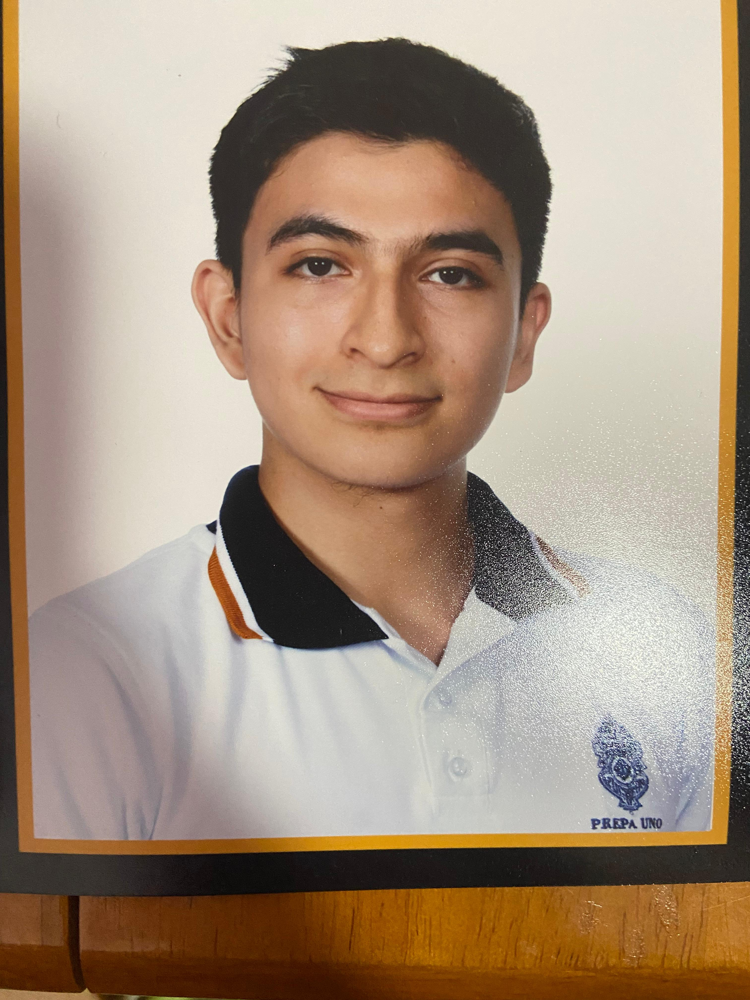
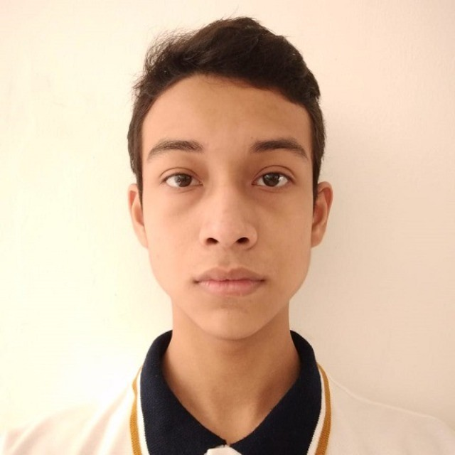

# Equipo de Interacción Humano Computadora

En este repositorio se lleva un registro de las actividades necesarias para el desarrollo de los proyectos para la materia Interacción Humano Computadora. Les compartimos la información relacionada:

###  "Facultad de Matemáticas"
#### Interacción Humano Computadora

## 👨‍🏫 Maestro encargado
 - Vitor Hugo Menéndez Domínguez

# 👥 Integrantes del equipo

---

### Campos García Karen Elizabeth 

**Presentación:**  
*"Soy estudiante de Ingeniería de Software, apasionada por Dios y el arte. Disfruto de la música, el dibujo y el deporte, combinando mi lado creativo con mi formación profesional para aprender algo nuevo cada día."*

---

### Cuevas García Braulio Samuel

**Presentación:**  
*"Soy un estudiante de ingeniería de software de la Uady, me gusta el mundo de la tecnología e informática, del deporte y de la música, soy una persona tiene gran habilidad para trabajar lo mismo durante mucho tiempo sin "fastidiarse"."*  

---

### Dzay Villanueva Mauricio

**Presentación:**  
*"Soy un apasionado de la programación y me considero bastante autodidacta. Dedico parte de mi tiempo libre a seguir aprendiendo de todo un poco, con la idea de que, en el futuro, estaré preparado para buscar soluciones, resolver problemas y liderar cualquier tipo de situación."*

---

### Madera De Regil Capi

**Presentación:**  
*"Actualmente estoy cursando una Licenciatura en Ingeniería de Software. Soy apasionado, aventurero y decidido, con 3 años de experiencia en programación con C# aplicada al desarrollo de videojuegos. Gracias a mi experiencia, he adquirido pensamiento crítico y habilidades para la resolución de problemas, además de experiencia trabajando con equipos y liderándolos. Soy responsable, estoy motivado y con muchas ganas de aprender."*

---

### Moo Pan Jareth Jaziel

**Presentación:**  
*"Soy Jareth Moo, un estudiante de ingeniería de software, apasionado por Dios, la tecnología, las matemáticas y, en general, todo el mudo informático. Me encanta disfrutar de mi tiempo libre, pero aprovecharlo también para aprender cosas nuevas."*

---

## Documentación:

[📂 Ver Primera Entrega](./Primera_Entrega/)
